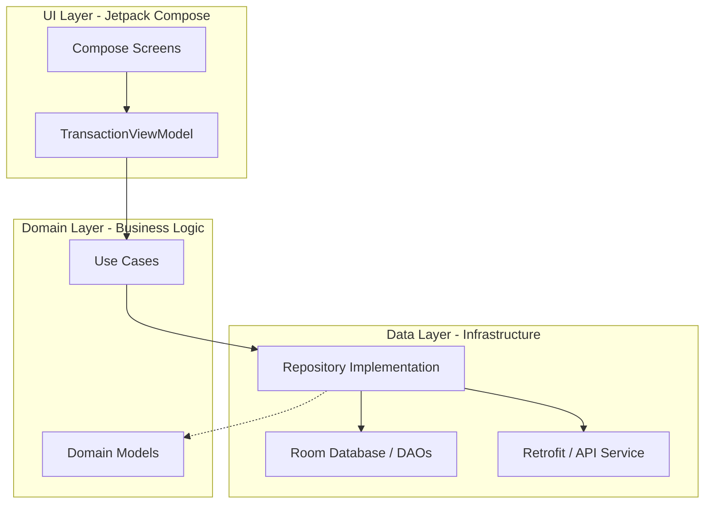
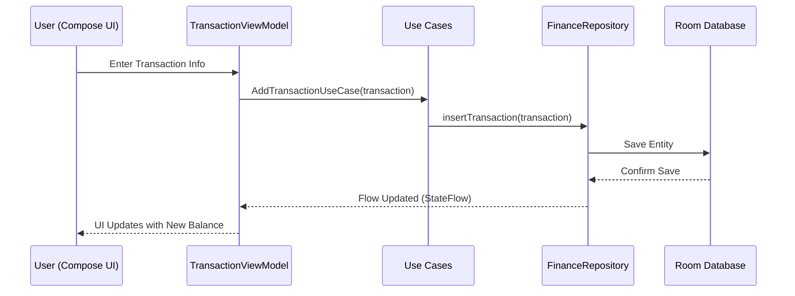

# 💰 Finance Tracker App - Personal Educational Project

  
  
  
  

---

## 🌟 Overview

Welcome to the **Finance Tracker App**! This project is a **Personal Educational Endeavor** designed to master the modern Android development ecosystem. The goal was to build a robust, production-ready financial application while adhering to the highest standards of software engineering, Clean Architecture, and the **MAD (Modern Android Development)** approach.

This app allows users to track their daily transactions, visualize their financial health through a vibrant dashboard, and manage their income and expenses with ease.

---

## 🚀 Key Features

- **Vibrant Dashboard**: A visually stunning summary of Total Balance, Income, and Expenses using modern gradients.
- **Transaction Management**: Effortlessly add and track income/expense items with categories.
- **Persistent Storage**: Robust local data management using **Room Database**.
- **Modern Navigation**: Seamless screen transitions powered by **Jetpack Navigation**.
- **Reactive UI**: State-driven UI updates using **StateFlow** and **Jetpack Compose**.
- **Real-time Calculations**: Automatic balance updates as transactions are recorded.

---

## 📸 Visual Showcase

  
  
  

  
  
  

---

## 🏗️ Architecture & Flow

This project strictly follows the **Clean Architecture** principles and the **MVVM (Model-View-ViewModel)** pattern to ensure scalability, maintainability, and testability.

### 🧩 MVVM Architecture Chart

### 🌊 Data Flow Diagram

---

## 🛠️ Tech Stack (MAD Skills)

This project leverages the latest tools and libraries recommended by Google for **Modern Android Development**.

| Category | Technology | Purpose |
| :--- | :--- | :--- |
| **Language** | [Kotlin](https://kotlinlang.org/) | Modern, concise, and safe programming. |
| **UI** | [Jetpack Compose](https://developer.android.com/jetpack/compose) | Declarative UI toolkit for building native UI. |
| **DI** | [Hilt (Dagger)](https://dagger.dev/hilt/) | Dependency injection for better modularity. |
| **Database** | [Room](https://developer.android.com/training/data-storage/room) | SQLite abstraction for local persistence. |
| **Networking** | [Retrofit](https://square.github.io/retrofit/) | Type-safe HTTP client for API communication. |
| **Async** | [Coroutines & Flow](https://kotlinlang.org/docs/coroutines-overview.html) | Reactive streams and structured concurrency. |
| **Navigation** | [Navigation Compose](https://developer.android.com/jetpack/compose/navigation) | In-app navigation for Compose. |

---

## 📊 MAD Scorecard

| Modern Android Development Area | Score | Status |
| :--- | :--- | :--- |
| **Language (Kotlin)** | 10/10 | 100% Kotlin, using Coroutines/Flow. |
| **UI (Compose)** | 10/10 | Fully declarative UI with Material 3. |
| **Architecture (Jetpack)** | 9/10 | Use Cases, ViewModels, and Hilt. |
| **Storage (Room)** | 10/10 | Reactive Flow-based database. |
| **Networking (Retrofit)** | 9/10 | Ready for API integration. |

**Overall MAD Mastery: 🚀 EXCELLENT**

---

## 🎓 Learning Objectives

Through this project, I have successfully gained expertise in:
- **Clean Architecture**: Decoupling code into distinct layers (Data, Domain, UI).
- **Jetpack Compose**: Managing state, building custom layouts, and using modern themes.
- **Dependency Injection**: Mastering Hilt for managing complex dependency graphs.
- **Reactive Programming**: Using `Flow` and `StateFlow` for real-time UI updates.
- **Gradle & Build Systems**: Managing KSP, Hilt plugins, and Version Catalogs (`libs.versions.toml`).

---
